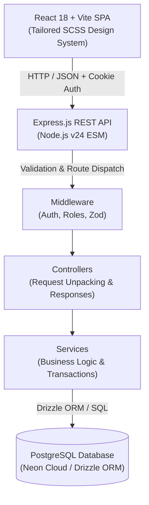
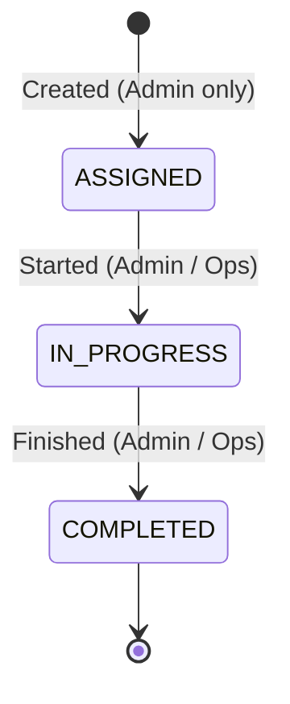
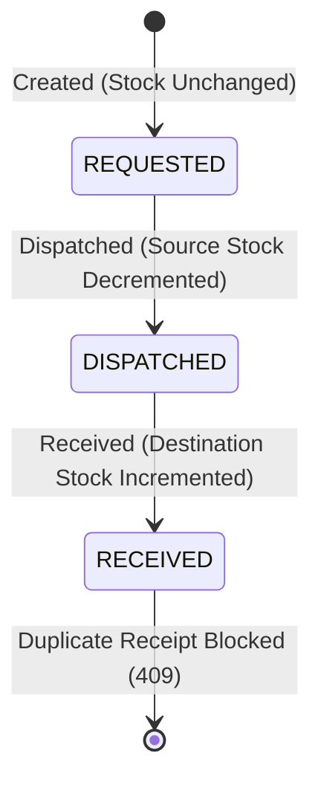
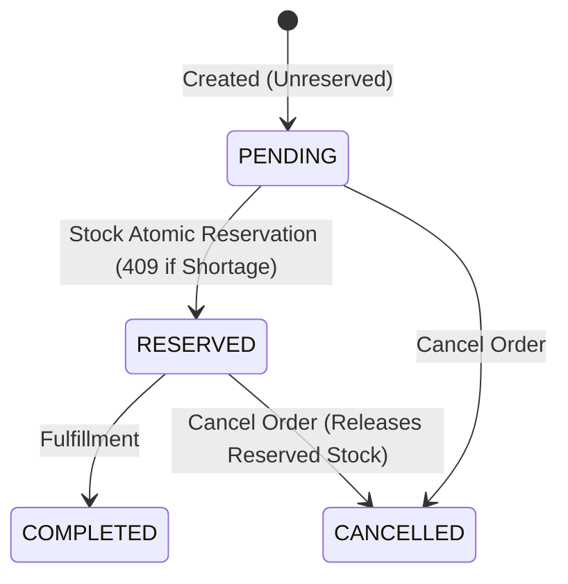

# Architecture & System Design

## 1. System Overview

Mini Operations ERP is built using a modern decoupled PERN architecture (PostgreSQL, Express.js, React, Node.js) with strict architectural boundaries, database-enforced invariants, and atomic transaction handling for concurrent inventory operations.



---

## 2. Layer Responsibilities & Separation of Concerns

1. **Routing Layer (`src/routes/`)**
   - Connects HTTP verb + path to middleware pipelines and controller handlers.
   - Strictly contains no database queries or business rules.

2. **Middleware Layer (`src/middlewares/`)**
   - `auth.middleware.js`: Verifies JWT from HTTP-only secure cookie and populates `req.user`.
   - `role.middleware.js`: Enforces Role-Based Access Control (`ADMIN`, `OPERATIONS`, `SALES`).
   - `validate.middleware.js`: Validates input schemas using Zod before reaching controllers.
   - `error.middleware.js`: Central error interceptor handling PostgreSQL constraint codes (`23505`, `23503`, `23514`), `AppError` operational codes, and fallback 500s.

3. **Controller Layer (`src/controllers/`)**
   - Thin dispatchers: Extract request params/body → invoke corresponding service → return structured response via `sendSuccess` or forward error to `next(err)`.

4. **Service Layer (`src/services/`)**
   - Contains all domain rules, validation computations, status transition logic, and database transaction lifecycles (`db.transaction(...)`).

5. **Data Layer (`src/models/` & `src/config/db.config.js`)**
   - Drizzle ORM schemas with explicit PostgreSQL constraints (CHECK constraints, Unique indexes, Foreign Key cascades).

---

## 3. Concurrency & Transaction Safety Strategy

### Problem: Race Conditions in Stock Reservation & Transfer
In high-concurrency environments, checking inventory availability in application code (`if (available >= requested)`) before executing an `UPDATE` leads to double-allocation bugs when two requests arrive simultaneously.

### Solution: Atomic PostgreSQL Conditional Updates
All inventory deductions and reservations are executed inside transactional conditional updates:

```sql
UPDATE inventory
SET reserved_quantity = reserved_quantity + $quantity,
    updated_at = NOW()
WHERE item_id = $itemId
  AND location_id = $locationId
  AND (physical_quantity - reserved_quantity) >= $quantity
RETURNING id;
```

- If another transaction claimed the last unit in the millisecond between reading and writing, the `WHERE` clause condition evaluates to false, updating **0 rows**.
- The service detects 0 affected rows and immediately aborts the transaction with `409 Conflict`, rolling back all staged mutations.

---

## 4. State Machine & Status Lifecycle

### Work Orders


### Internal Transfers


### Customer Orders


---

## 5. Security & Authentication Model

- **JWT Storage:** Transmitted strictly in `HttpOnly`, `SameSite=Strict`, `Secure` (in production) cookies. This eliminates XSS-based token theft.
- **Password Hashing:** Passwords hashed with `bcryptjs` using a work factor of 12.
- **RBAC Matrix:**

| Role | Inventory (Read/Adjust) | Work Orders (Create/Status) | Transfers (Create/Dispatch/Receive) | Customer Orders (Create/Reserve/Cancel) |
|---|---|---|---|---|
| `ADMIN` | Full (Read + Adjust) | Full (Create + Status) | Full (Create + Dispatch + Receive) | Full (Create + Reserve + Cancel) |
| `OPERATIONS` | Full (Read + Adjust) | Status Update only | Full (Create + Dispatch + Receive) | Read only |
| `SALES` | Read only | Read only | Read only | Full (Create + Reserve + Cancel) |
