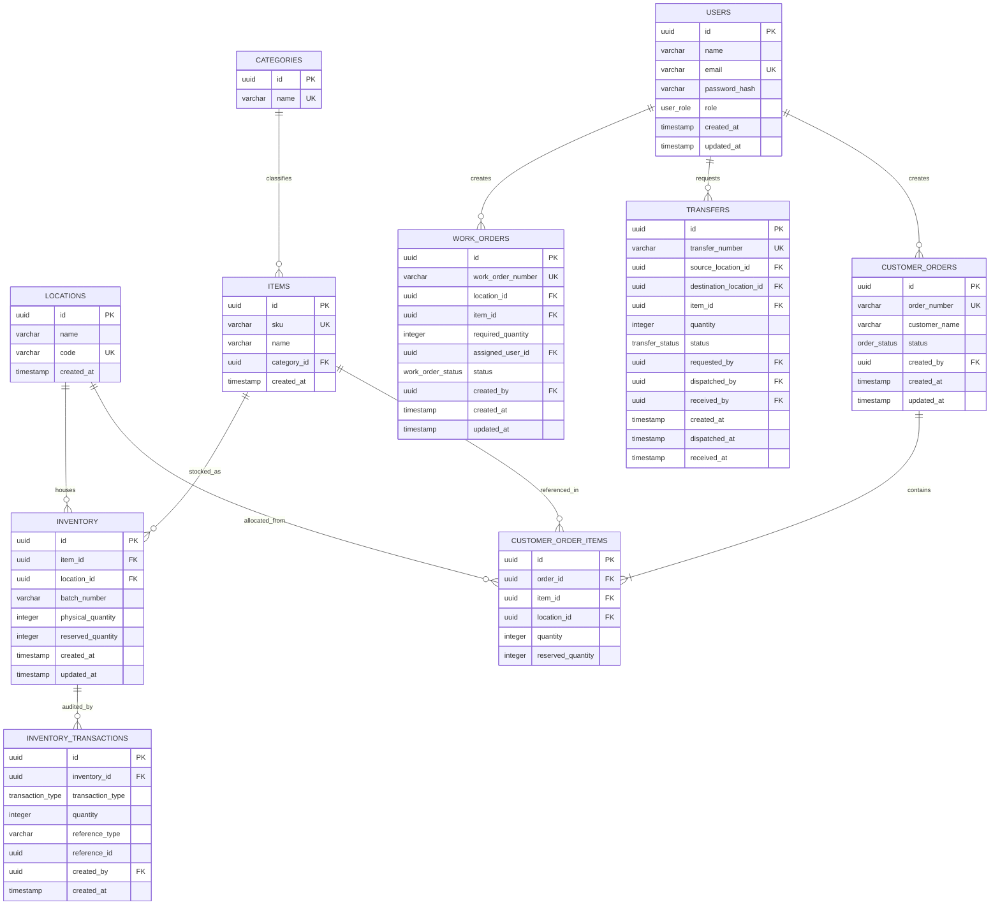

# Database Schema & Entity Relationships

## 1. Entity Relationship Diagram (ERD)

---

## 2. Table Specifications & Constraints

### `users`
- `id`: UUID primary key default `gen_random_uuid()`
- `email`: Unique, non-null
- `role`: PostgreSQL enum `('ADMIN', 'OPERATIONS', 'SALES')`

### `locations`
- `code`: Unique warehouse/facility identifier (e.g. `WH-MAIN`, `WH-BRANCH`)

### `items`
- `sku`: Unique stock keeping unit (e.g. `ELEC-001`)
- `category_id`: Foreign key referencing `categories(id)`

### `inventory` (Core Ledger Anchor)
- `unique_item_location_batch`: `UNIQUE (item_id, location_id, batch_number)`
- `physical_qty_non_negative`: `CHECK (physical_quantity >= 0)`
- `reserved_qty_non_negative`: `CHECK (reserved_quantity >= 0)`
- `reserved_lte_physical`: `CHECK (reserved_quantity <= physical_quantity)`

> **Computed Field Rule**: `available_quantity` is computed as `physical_quantity - reserved_quantity` dynamically in the service layer to avoid data drift.

### `inventory_transactions` (Audit Trail)
- `transaction_type`: Enum `('ADJUSTMENT', 'TRANSFER_DISPATCH', 'TRANSFER_RECEIPT', 'RESERVATION', 'RESERVATION_RELEASE')`
- `quantity`: Signed integer (+ for addition, - for deduction)

### `transfers`
- `transfer_number`: Unique (Format: `TRN-YYYYMMDD-XXXX`)
- `status`: Enum `('REQUESTED', 'DISPATCHED', 'RECEIVED')`

### `work_orders`
- `work_order_number`: Unique (Format: `WO-YYYYMMDD-XXXX`)
- `status`: Enum `('ASSIGNED', 'IN_PROGRESS', 'COMPLETED')`

### `customer_orders` & `customer_order_items`
- `order_number`: Unique (Format: `ORD-YYYYMMDD-XXXX`)
- `status`: Enum `('PENDING', 'RESERVED', 'COMPLETED', 'CANCELLED')`
- Foreign key cascade on `customer_order_items(order_id)` for relational integrity.
